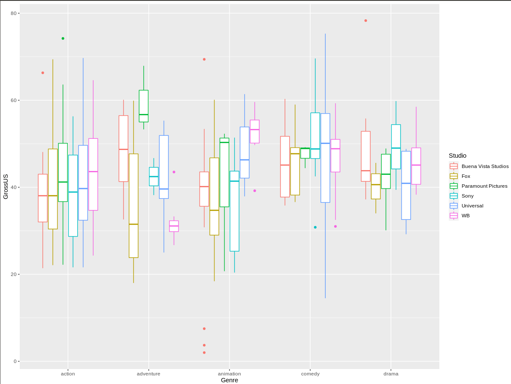
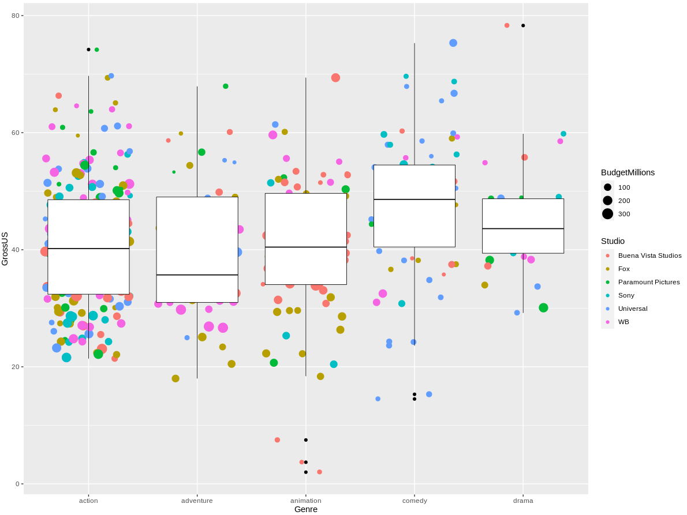
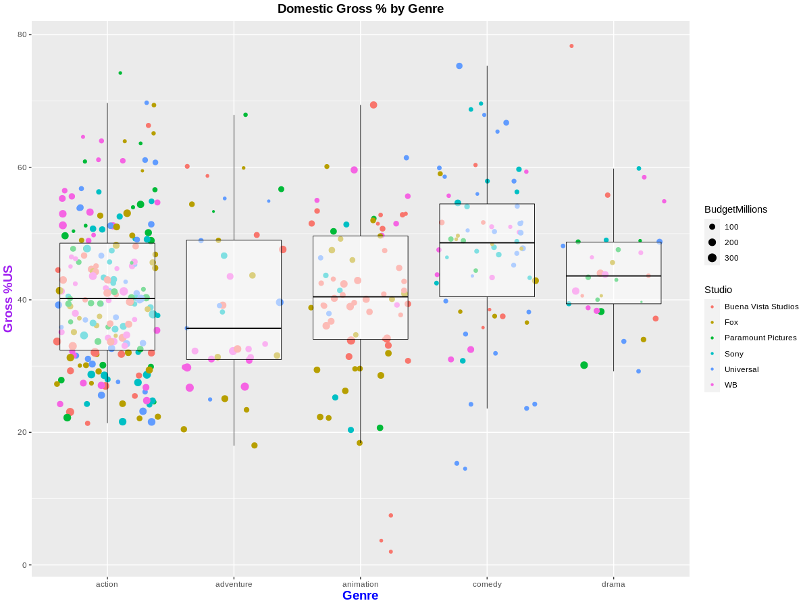

# Quiz 2

```R
getwd()
setwd("/home/eduardo/Escritorio/Tareas Mineria/Examen")
#setwd("/Users/VinceLAB/Documents/ITT /Ene - Jun 2020/Mineria/RepoGitHub/MineriaRepo/Unidad2/Evaluacion")
getwd()
```
 We load the svc
 ```R
movies <- read.csv("Project-Data.csv")
```
 We indicate which columns are the ones we use from our dataset
 ```R
movies <- movies [c(3,6,8,18)]
```
Since the review manager is only interested in certain genres of movies we filter our dataset
```R
movies<-movies[movies$Genre=="action"|movies$Genre=="adventure"|movies$Genre=="animation"|movies$Genre=="comedy"|movies$Genre=="drama",]
```

 It tells us that the studios you are interested in are the following, Buena Vista Studios, Fox, Paramount Picture, Sony, Universal and WB.

```R
movies<-movies[movies$Studio=="Buena Vista Studios" | movies$Studio=="Fox" | movies$Studio=="Paramount Pictures" 
               |movies$Studio=="Sony" |movies$Studio=="Universal" |movies$Studio=="WB",]
```

 we look at the first data of our dataset
 ```R
head(movies)
```
Rename the columns
```R
colnames(movies) <- c("Genre", "Studio", "BudgetMillions", "GrossUS")
```
We look at the first 6 records
```R
head(movies)
```
We look at the last 6 records
```R
tail(movies)
```
We look at the structure of our data
```R
str(movies)
```
We look at a general summary of the data
```R
summary(movies)
```


we import the ggplot2 library to graph and use aesthetics
```R
library(ggplot2)
```
## boxplots

### We start to build our graph


To our varaiable we load our dataset movies. For aesthetics we say that on the x axis it will be determined by Genre, the axis and is determined by GrossUS. Each color in the chart will be determined by Studio and Size by BudgetMIlllions.
```R
u <- ggplot(movies, aes(x=Genre, y=GrossUS,
                        color=Studio, size=BudgetMillions))
```

Plot indicating the type of graph in this case with box diagrams
```R
u + geom_boxplot()  
```


We indicate the thickness of the outline and the color of the boxes by adding the density of points on it.
```R
u +  geom_jitter() + geom_boxplot(size=0.3,color="Black") 
```


We indicate the opacity of the boxes to be able to notice the dispersion removing the unusual points. Finally we add a title and name our axes "x" and "y".

```R
u + geom_jitter(shape=20) + geom_boxplot(size=0.3,alpha=0.5,color="Black",outlier.shape = NA)+ theme(
  plot.title = element_text(color="Black", size=14, face="bold", hjust = 0.5),
  axis.title.x = element_text(color="blue", size=14, face="bold"),
  axis.title.y = element_text(color="purple", size=14, face="bold")
)  +  ggtitle("Domestic Gross % by Genre") + ylab("Gross %US") 
```



## Analysis

In the graph we can see the relationship of gross percentage that each film study collected in that genre.

In it we can see from the budget million what was invested in the film and its gross percentage, it is possible to see in the atypical points how the Buena Vista Studio in the animation genre had some films with a low percentage of reactivation. In contrast, in the action genre, the Sony, WB, Buena Vista Studio and Universal studios can be seen to have a very good collection percentage.