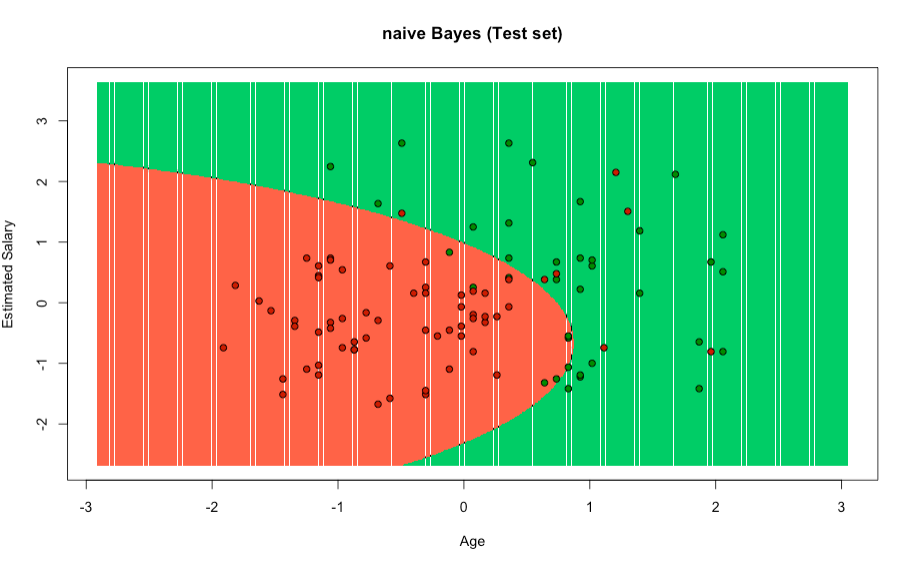

# Test 2.2

The first things to do is import the dataset into a dataframe to manipulate the data in a easy way. And select the desire columns that we'll work on them.

```R
dataset = read.csv('Social_Network_Ads.csv')
dataset = dataset[3:5]
```

We need to transform the value of Purchased column into a boolean value to manipulate the column.

```R
dataset$Purchased = factor(dataset$Purchased, levels = c(0, 1))
```

We're ready to split our dataset into 2 samples, one for training and the other for testing using the purchased column.

```R
split = sample.split(dataset$Purchased, SplitRatio = 0.75)
training_set = subset(dataset, split == TRUE)
test_set = subset(dataset, split == FALSE)
```

Feature scaling

```R
training_set[-3] = scale(training_set[-3])
test_set[-3] = scale(test_set[-3])
```

In this parts we're fitting naive bayes to training set

```R
classifier = naiveBayes(formula = Purchased ~ .,
                        data = training_set,
                        type = 'raw',
                        laplace= 3)
```

We made the preditictions using the test set

```R
y_pred = predict(classifier, newdata = test_set[-3])
y_pred
```

Make the confusion metrix using the test set

```R
cm = table(test_set[, 3], y_pred)
confusionMatrix(cm)
```

Then, we're ready to visualize the predictions using the ElemStatLearn library. Using the test set results.

```R
library(ElemStatLearn)
set = test_set
X1 = seq(min(set[, 1]) - 1, max(set[, 1]) + 1, by = 0.01)
X2 = seq(min(set[, 2]) - 1, max(set[, 2]) + 1, by = 0.01)
grid_set = expand.grid(X1, X2)
colnames(grid_set) = c('Age', 'EstimatedSalary')
y_grid = predict(classifier, newdata = grid_set)
plot(set[, -3], main = 'naive Bayes (Test set)',
     xlab = 'Age', ylab = 'Estimated Salary',
     xlim = range(X1), ylim = range(X2))
contour(X1, X2, matrix(as.numeric(y_grid), length(X1), length(X2)), add = TRUE)
points(grid_set, pch = '.', col = ifelse(y_grid == 1, 'springgreen3', 'tomato'))
points(set, pch = 21, bg = ifelse(set[, 3] == 1, 'green4', 'red3'))
```

## Plot



## Analysis

Based on the results using the naive bayes algorithms and plotting the data, we can conclude that categorical data used in this algoreithms show the preediccions if some people purchased something usisng using the independetn variable as purchased, also we got others columns such as age and estimated salary. Looking the plot we seeing that the green background are the who purchased the ads and the red one whose not purchased the ads.
