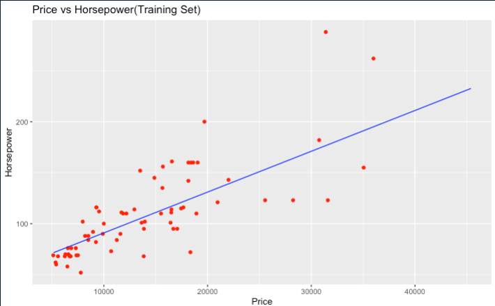

## Simple Linear Regression

> Linear regression is used to predict the value of an outcome variable Y based on one or more input predictor variables X.

We're following the algorithm of simple linear regression in R

### Algorithm in R

The first things to do is import the dataset into a dataframe to manipulate the data in a easy way.

```r
dataset <- read.csv('CarDataSet.csv')
```

After of loading the dataset we're almost ready to start the algorithm, next thing is split the data in 2 parts one for testing dataframe and the other for training dataframe.

```r
split <- sample.split(dataset$price, SplitRatio = 2/3)
training_set <- subset(dataset, split == TRUE)
test_set <- subset(dataset, split == FALSE)
```

Now we're able to implement the algorithm, to do that we need first defined the formula and the dataset that we'll use in the algorithm, all this stuff inside a variable called regressor.

```r
regressor = lm(formula = horsepower ~ price,
               data = dataset)
summary(regressor)
```

Then, we need to create the prediction using the Predict function with the testing dataset.

```r
y_pred = predict(regressor, newdata = test_set)
```

At this point, we're almost finished with the algorithm but first we need to show the data in a visual way using the library ggplot() to generate an graphic.

```r
ggplot() +
  geom_point(aes(x=test_set$price, y=test_set$horsepower),
             color = 'red') +
  geom_line(aes(x = training_set$price, y = predict(regressor, newdata = training_set)),
            color = 'blue') +
  ggtitle('Price vs Horsepower(Training Set)') +
  xlab('Price') +
  ylab('Horsepower')
```

### Results


