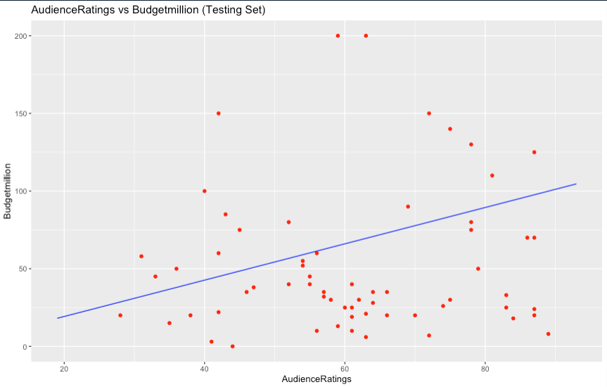

## Multiple Linear Regression

> Multiple linear regression is an extension of simple linear regression used to predict an outcome variable (y) on the basis of multiple distinct predictor variables (x).

We're following the algorithm of multiple linear regression in R

### Algorithm in R

The first things to do is import the dataset into a dataframe to manipulate the data in a easy way.

```r
dataset <- read.csv('movieRatings.csv')
```

We need to change the type of data for the field State in order to manipulate.

```r
dataset$Genre = factor(dataset$Genre,
                       levels = c('Action', 'Adventure', 'Comedy'),
                       labels = c(1,2,3))
```

After of conversion the dataset we're almost ready to start the algorithm, next thing is split the data in 2 parts one for testing dataframe and the other for training dataframe.

```r
split <- sample.split(dataset$Budgetmillion, SplitRatio = 0.8)
training_set <- subset(dataset, split == TRUE)
test_set <- subset(dataset, split == FALSE)
```

Now we're able to implement the algorithm, to do that we need first defined the formula and the dataset that we'll use in the algorithm, all this stuff inside a variable called regressor.

```r
regressor = lm(formula = Budgetmillion ~ AudienceRatings,
               data = training_set )
summary(regressor)
```

Then, we need to create the prediction using the Predict function with the testing dataset.

```r
y_pred = predict(regressor, newdata = test_set)
y_pred
```

At this point, we're almost finished with the algorithm but first we need to show the data in a visual way using the library ggplot() to generate an graphic.

```r
ggplot() +
  geom_point(aes(x=test_set$AudienceRatings, y=test_set$Budgetmillion),
             color = 'red') +
  geom_line(aes(x = training_set$AudienceRatings, y = predict(regressor, newdata = training_set)),
            color = 'blue') +
  ggtitle('AudienceRatings vs Budgetmillion (Testing Set)') +
  xlab('AudienceRatings') +
  ylab('Budgetmillion')
```

### Results


