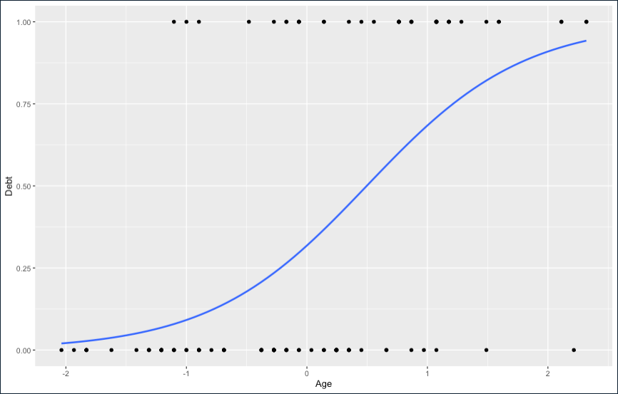
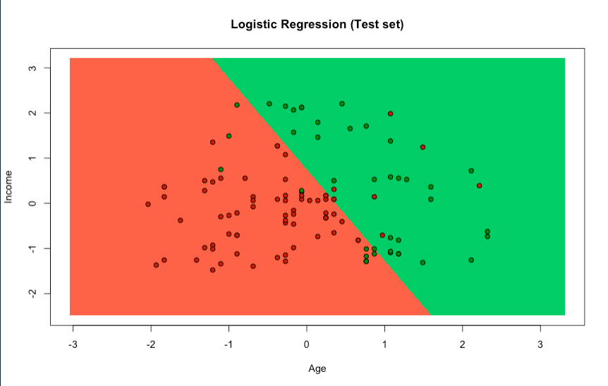

## Logistic Regression

> Logistic regression is the appropriate regression analysis to conduct when the dependent variable is dichotomous (binary). Like all regression analyses, the logistic regression is a predictive analysis. Logistic regression is used to describe data and to explain the relationship between one dependent binary variable and one or more nominal, ordinal, interval or ratio-level independent variables.

We're following the algorithm of Logistic Regression in R

### Algorithm in R

The first things to do is import the dataset into a dataframe to manipulate the data in a easy way.

```r
dataset <- read.csv('credit.csv')
dataset <- dataset[, 3:5]
```

We're almost ready to start the algorithm, next thing is split the data in 2 parts one for testing dataframe and the other for training dataframe.

```r
split <- sample.split(dataset$Debt, SplitRatio = 0.75)
training_set <- subset(dataset, split == TRUE)
test_set <- subset(dataset, split == FALSE)
```

Now we're able to implement the algotirhm, to do that we need first defined the formula and the dataset that we'll use in the algorithm, all this stuff inside a variabel called classifier.

```r
classifier = glm(formula = Debt ~ .,
                 family = binomial,
                 data = training_set)
```

Then, we need to create the prediction using the Predict function with the testing dataset.

```r
prob_pred = predict(classifier, type = 'response', newdata = test_set[-3])
prob_pred
y_pred = ifelse(prob_pred > 0.5, 1, 0)
y_pred
```

At this point, we're almost finish with the algorithm but first we need to show the data in a visual way using the library ggplot() to generate an graphic.

```r
ggplot(test_set, aes(x=Income, y=Debt)) + geom_point() +
  stat_smooth(method="glm", method.args=list(family="binomial"), se=FALSE)
```

### Results



We use the ElemStatLibrary to generate an graphic with other meaning.

```r
library(ElemStatLearn)
set = test_set
X1 = seq(min(set[, 1]) - 1, max(set[, 1]) + 1, by = 0.01)
X2 = seq(min(set[, 2]) - 1, max(set[, 2]) + 1, by = 0.01)
grid_set = expand.grid(X1, X2)
colnames(grid_set) = c('Age', 'Income')
prob_set = predict(classifier, type = 'response', newdata = grid_set)
y_grid = ifelse(prob_set > 0.5, 1, 0)
plot(set[, -3],
     main = 'Logistic Regression (Test set)',
     xlab = 'Age', ylab = 'Income',
     xlim = range(X1), ylim = range(X2))
contour(X1, X2, matrix(as.numeric(y_grid), length(X1), length(X2)), add = TRUE)
points(grid_set, pch = '.', col = ifelse(y_grid == 1, 'springgreen3', 'tomato'))
points(set, pch = 21, bg = ifelse(set[, 3] == 1, 'green4', 'red3'))
```

### Results


