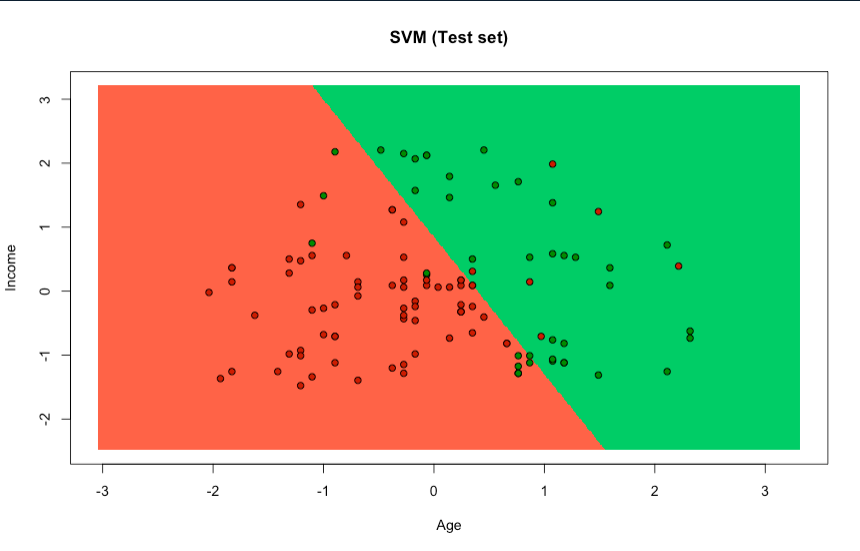

## Support Vector Machine

> A support vector machine (SVM) is machine learning algorithm that analyzes data for classification and regression analysis. SVM is a supervised learning method that looks at data and sorts it into one of two categories.

We're following the algorithm of Logistic Regression in R

### Algorithm in R

The first things to do is import the dataset into a dataframe to manipulate the data in a easy way.

```r
dataset = read.csv('credit.csv')
dataset = dataset[3:5]
```

We're almost ready to start the algorithm, next thing is split the data in 2 parts one for testing dataframe and the other for training dataframe.

```r
split = sample.split(dataset$Debt, SplitRatio = 0.75)
training_set = subset(dataset, split == TRUE)
test_set = subset(dataset, split == FALSE)
```

Now we're able to implement the algorithm, to do that we need first defined the formula and the dataset that we'll use in the algorithm, all this stuff inside a variable called classifier.

```r
classifier = svm(formula = Debt ~ .,
                 data = training_set,
                 type = 'C-classification',
                 kernel = 'linear')
```

Then, we need to create the prediction using the Predict function with the testing dataset.

```r
y_pred = predict(classifier, newdata = test_set[-3])
y_pred
```

At this point, we're almost finished with the algorithm but first we need to show the data in a visual way using the ElemStatLibrary to generate an graphic.

```r
library(ElemStatLearn)
set = test_set
X1 = seq(min(set[, 1]) - 1, max(set[, 1]) + 1, by = 0.01)
X2 = seq(min(set[, 2]) - 1, max(set[, 2]) + 1, by = 0.01)
grid_set = expand.grid(X1, X2)
colnames(grid_set) = c('Age', 'Income')
y_grid = predict(classifier, newdata = grid_set)
plot(set[, -3], main = 'SVM (Test set)',
     xlab = 'Age', ylab = 'Income',
     xlim = range(X1), ylim = range(X2))
contour(X1, X2, matrix(as.numeric(y_grid), length(X1), length(X2)), add = TRUE)
points(grid_set, pch = '.', col = ifelse(y_grid == 1, 'springgreen3', 'tomato'))
points(set, pch = 21, bg = ifelse(set[, 3] == 1, 'green4', 'red3'))
```

### Results


