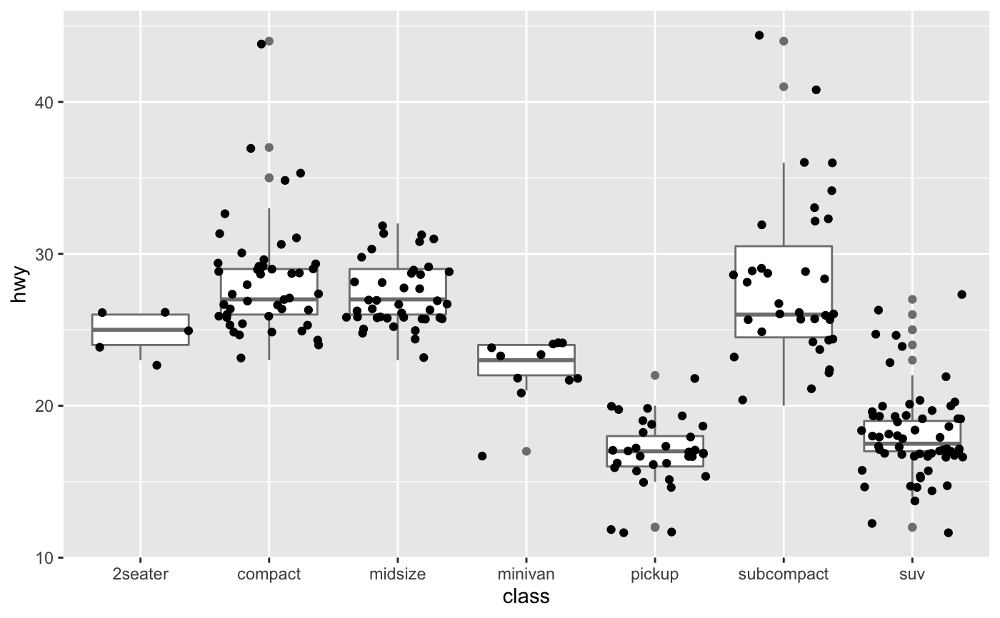

# Function geom_jitter()

> The jitter geom is a convenient shortcut for geom_point(position = "jitter"). It adds a small amount of random variation to the location of each point, and is a useful way of handling overplotting caused by discreteness in smaller datasets.

**Expample**

```R
# Jittering is useful when you have a discrete position, and a relatively
# small number of points
# take up as much space as a boxplot or a bar
ggplot(mpg, aes(class, hwy)) +
  geom_boxplot(colour = "grey50") +
  geom_jitter()

```
