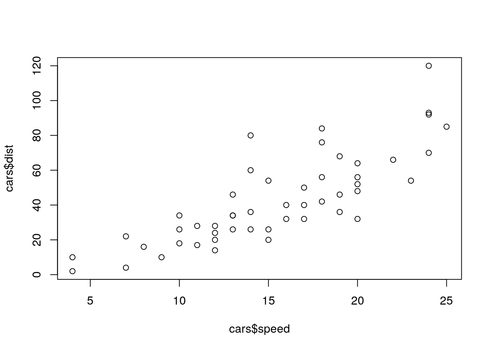
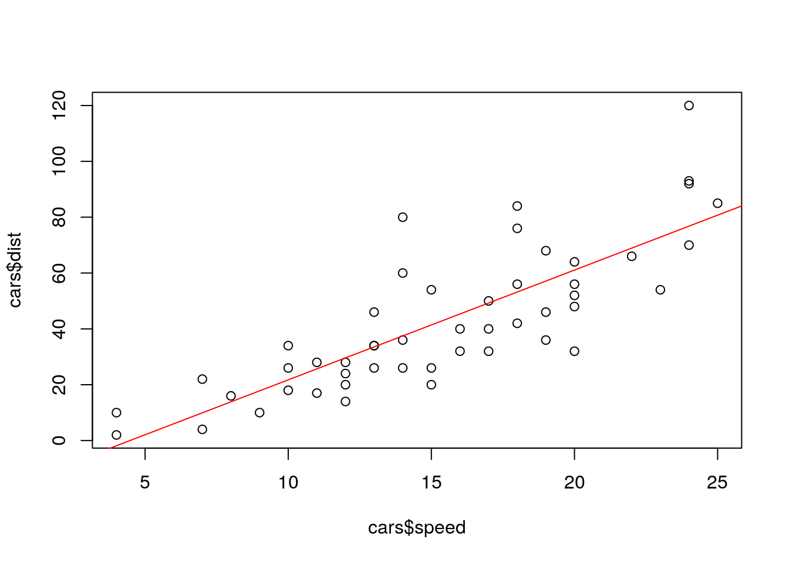

# Function SplitRatio and lm()

## SplitRatio

**Description**

Split data from vector Y into two sets in predefined ratio while preserving relative ratios of different labels in Y. Used to split the data used during classification into train and test subsets.

**Usage**

 sample.split( Y, SplitRatio = 2/3, group = NULL )

**Arguments**

Y	

Vector of data labels. If there are only a few labels (as is expected) than relative ratio of data in both subsets will be the same.

**SplitRatio**	

Splitting ratio:

* if (0<=SplitRatio<1) then SplitRatio fraction of points from Y will be set toTRUE

* if (SplitRatio==1) then one random point from Y will be set to TRUE

* if (SplitRatio>1) then SplitRatio number of points from Y will be set to TRUE

**group**	

Optional vector/list used when multiple copies of each sample are present. In such a case group contains unique sample labels, marking all copies of the same sample with the same label, and the function tries to place all copies in either train or test subset. If provided than has to have the same length as Y.

## lm()

**lm()** es la función de R para ajustar modelos lineales. De ningún modo es la única, pero es la más importante. Dado que en un modelo lineal las variables no son simétricas usamos una sintaxis especial para introducirlas al modelo, señalando cuál está del lado izquierdo y cuál(es) del lado derecho, es decir, cuál es la dependiente y cuál es la independiente. Esa sintaxis especial se llama notación de fórmula y utiliza el símbolo ~ para separar el lado izquierdo del lado derecho. A la izquierda de ~ se ubica la variable dependiente, a la derecha la(s) independiente(s). La fórmula del modelo con el que ajustamos la recta azul es PO2SM~SPRIM, donde PO2SM y SPRIM son los nombres de dos vectores numéricos del mismo largo. Usualmente no trabajamos con vectores sueltos y utilizamos un data.frame que reúne a todas las variables de interés. En ese caso usamos los nombres de columna y agregamos el argumento data=nuestro.data.frame para indicar el entorno en el que debe buscar esos nombres. Si estamos haciendo alguna manipulación previa de datos y utilizamos el operador %>% para encadenar funciones usamos el comodín . para referir a los datos.

**lm()** permite ajustar modelos con más de una variable independiente. Del lado derecho unimos predictores3 con el signo +. Adicionalmente podemos utilizar los signos * para especificar interacciones entre dos variables y : para las interacciones y los efectos directos.

La sintaxis básica es

```R

lm(dependiente~independiente1+independiente2, data=datos)

```



The graph above shows a point cloud. Linear regression builds the line that, in a way, best approximates that cloud.

```R
lm.dist.speed <- lm(cars$dist ~ cars$speed)
lm.dist.speed
## 
## Call:
## lm(formula = cars$dist ~ cars$speed)
## 
## Coefficients:
## (Intercept)   cars$speed  
##     -17.579        3.932

plot(cars$speed, cars$dist)
abline(lm.dist.speed, col = "red")
```


The preceding code uses the lm function to fit the linear regression model, displays a small summary of the model on the screen, and finally adds the regression line, in red, to the graph above.


