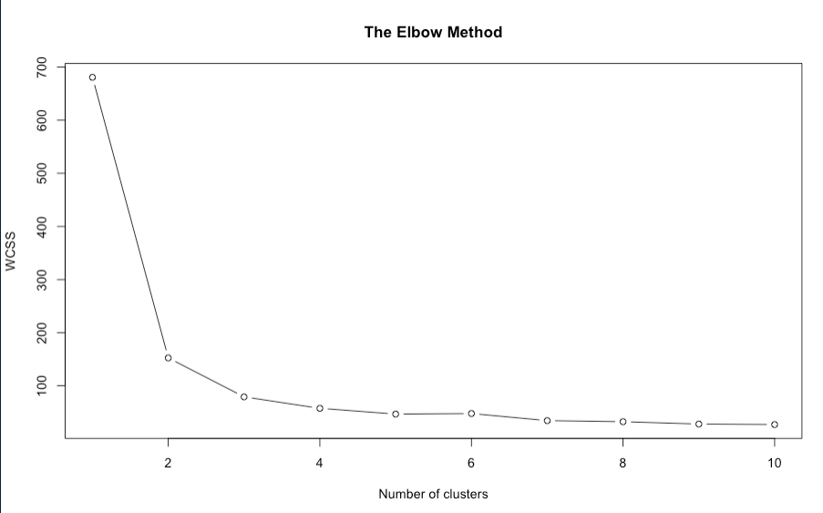
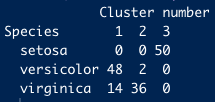
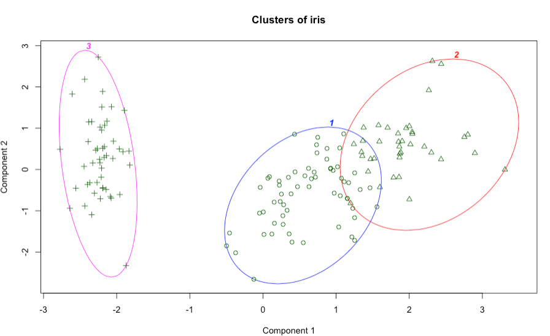
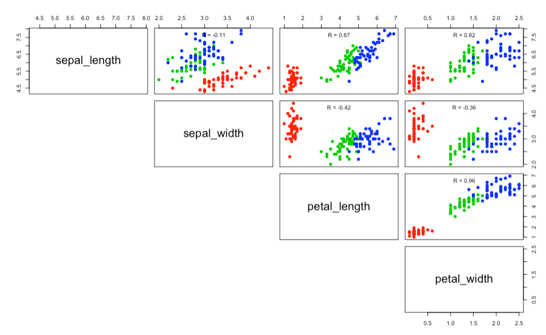

# Test 3.1

The first things to do is import the dataset into a dataframe to manipulate the data in a easy way. And select the desire columns that we'll work on them.

```R
dataset = read.csv('iris.csv')
head(dataset)
```

Next thing, it's define the class name fo the predections of clusters also select only the first 4 columns in our dataset into a new dataset.

```R
dataset.class<- dataset[,"species"]
dataset = dataset[1:4]
```

Let's start by determining the optimal amount of centroids to use from the Elbow Method.

```R
wcss = vector()
for (i in 1:10) wcss[i] = sum(kmeans(dataset, i)$withinss)
```

Once the WCSS values are calculated based on the amount of k centroids, we will graph the results

```R
plot(1:10,
     wcss,
     type = 'b',
     main = paste('The Elbow Method'),
     xlab = 'Number of clusters',
     ylab = 'WCSS')
```

#### WCSS graph



Based on the the amount of optimal k centroids we can apply the algorithm of k-means

```R
kmeans = kmeans(x = dataset, centers = 3)
y_kmeans = kmeans$cluster
```

Then, wi will print the clusters table to see the results of k-means and take a look of the predictions

```R
table(dataset.class,kmeans$cluster,dnn=c("Species","Cluster number"))
```

#### Table of clusters



once the k-means finished and we already saw the results we are ready to graph the clusters and see in a easy way the clusters and also what k-means did

```R
clusplot(dataset,
         y_kmeans,
         lines = 0,
         shade = FALSE,
         color = TRUE,
         labels = 4,
         plotchar = TRUE,
         span = TRUE,
         main = paste('Clusters of iris'),
         )
```

#### Clusters plot



```R
upper.panel<-function(x, y){
        points(x,y, pch=19, col=c("red", "green3", "blue")[dataset.class])
        r <- round(cor(x, y), digits=2)
        txt <- paste0("R = ", r)
        usr <- par("usr"); on.exit(par(usr))
        par(usr = c(0, 1, 0, 1))
        text(0.5, 0.9, txt)
}
```

```R
pairs(dataset, lower.panel = NULL,
      upper.panel = upper.panel)
```

#### Pairs graph



## Analysis
